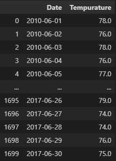
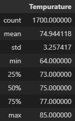

# Overview
  The purpose of this analysis is to help W. Avy likes in his persuit of opening a surf shop in Hawaii. Information about tempurature trends in June and December are needed to determine if the business is feasible and is sustainable year round.  

## Results

The images above from left to right show June temperatures, June statistics, December temperatures and December statistics. From that we can determine threes things.
  * The business seems feasible from June to December 
  * The average temperature ranges between low to mid 70s(74.9 degrees in June and 71 Degrees in December)
  * Max tempurature is 83 degrees in December and 85 Degrees in June.

## Summary
  Since higher tempuratures occur between June and December, relying on those two months alone will not be enough to determine whether the business will do well all year. Tempuratures begin to drop at the end of December and the average low reaches 56 degrees. It is possible lower tempuratures may occur in January.
Another factor we can include for analysis in these months is the level of percipitation. Having a good idea of the levels of rain can help determine how many days the shop may not be able to operate. 

  The following code will produce a list of perciptation occurances by date that can be used to produce a dataframe and statistics.

june_prcp = session.query(Measurement.date, Measurement.prcp).filter(extract("month",Measurement.date) == 6)
june_temp_list_prcp = [prcp for prcp in june_prcp]

june_temp_list_prcp

december_prcp = session.query(Measurement.date, Measurement.prcp).filter(extract("month",Measurement.date) == 12)
december_temp_list_prcp = [prcp for prcp in december_prcp]

december_temp_list_prcp

